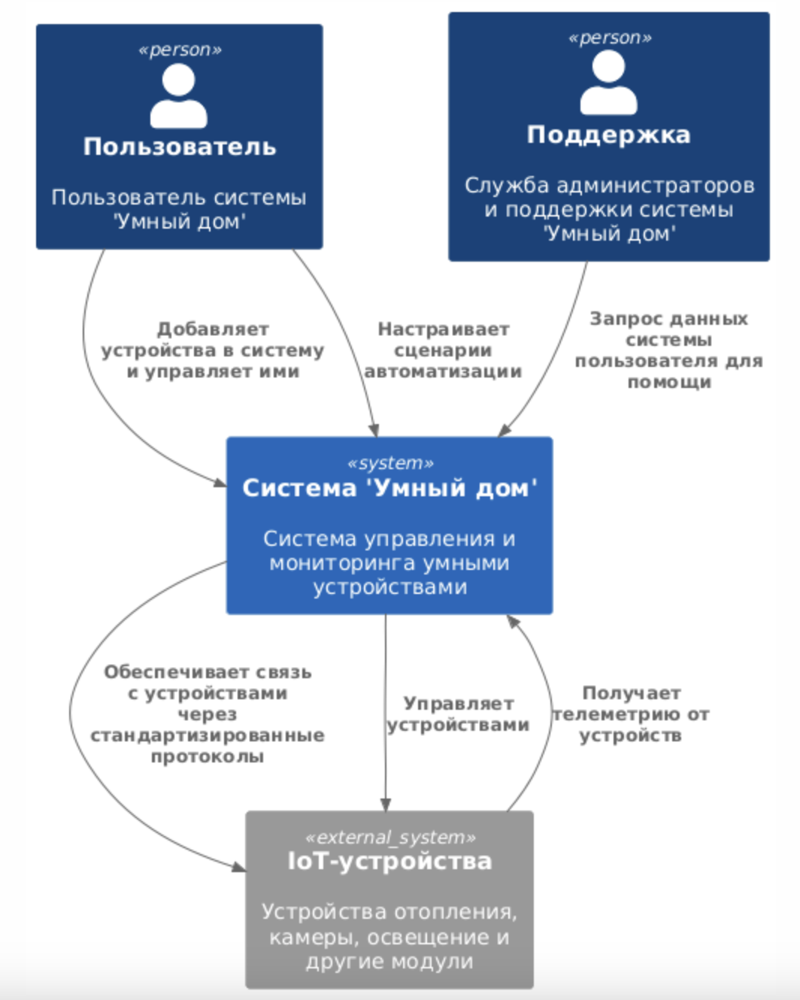
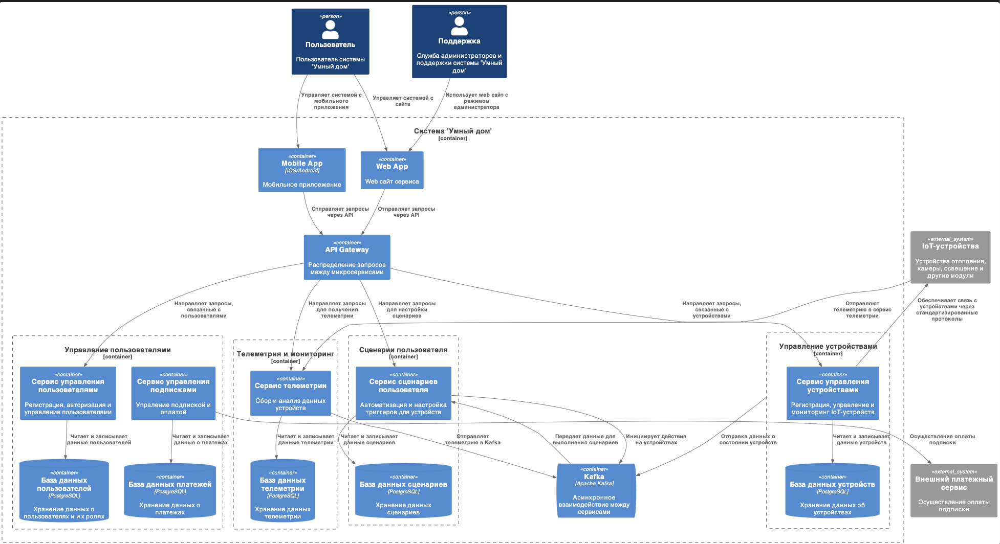
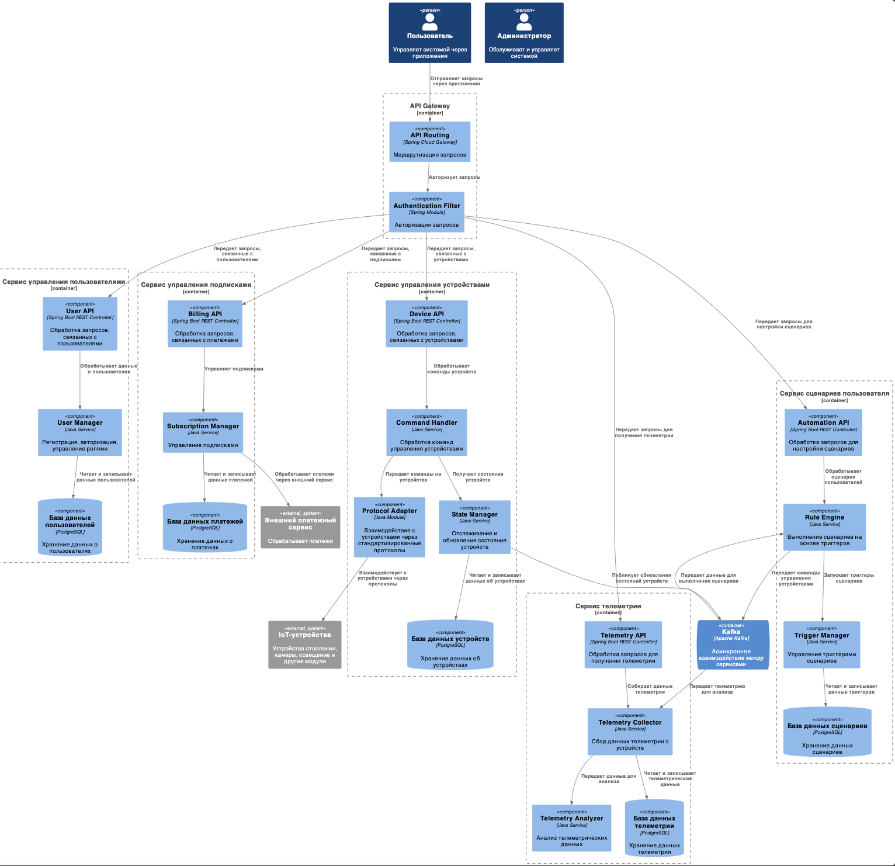
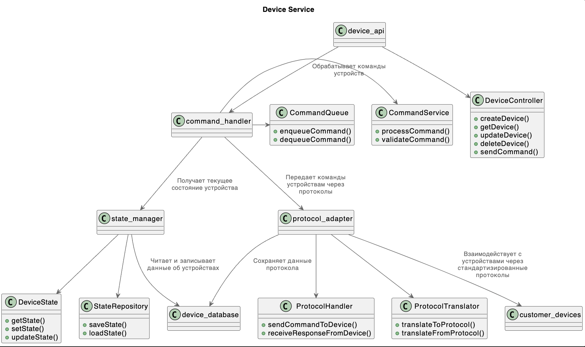
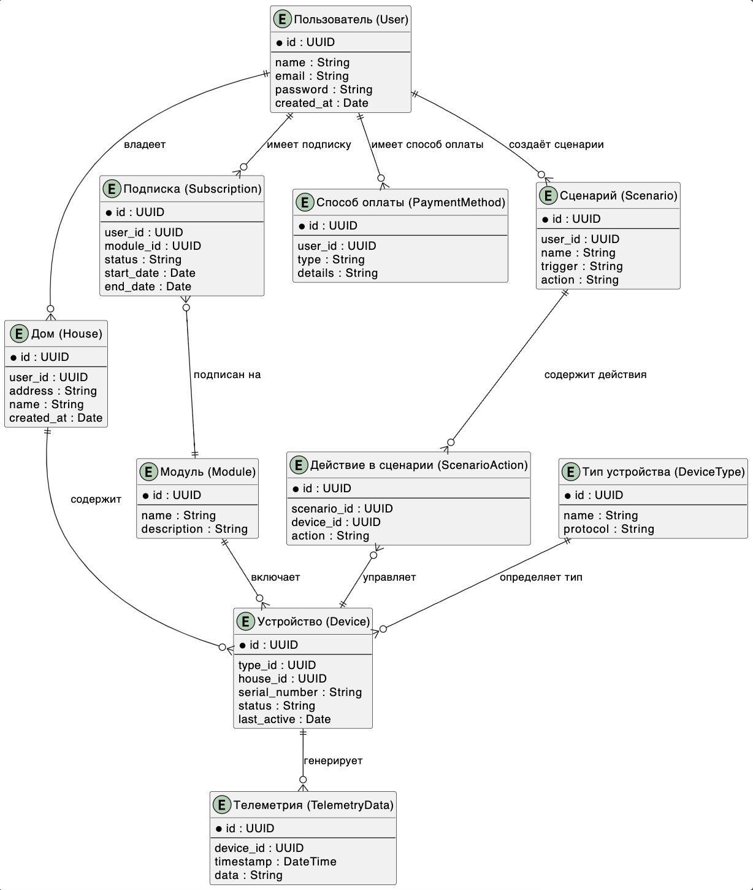

Это шаблон для решения **первой части** проектной работы. Структура этого файла повторяет структуру заданий. Заполняйте его по мере работы над решением.

# Задание 1. Анализ и планирование

Чтобы составить документ с описанием текущей архитектуры приложения, можно часть информации взять из описания компании условия задания. Это нормально.

### 1. Описание функциональности монолитного приложения

**Настройка системы:**
- Приложение поддерживает возможность добавления новых систем отопления 
- Приложение может вернуть данные о конкретной системе отопления по id системы

**Управление отоплением:**

- Пользователь может включить определенную систему отопления
- Пользователь может отключить определеннуюную систему отопления
- Пользователь может задать необходимую температуру

**Мониторинг температуры:**

- Пользователь может запросить текущую температуру

### 2. Анализ архитектуры монолитного приложения

- Архитектура приложения представляет из себя монолит на Java с бд Postgress.
- Приложение построено с использованием фреймворка Spring Boot для java
- Основные слои приложения:
  - Controller — управляет HTTP-запросами (REST API).
  - Service — реализует бизнес логику приложения
  - Repository — слой, необходимый для работы с бд
  - Entity — слой, для преобразования данных в объекты на java
- Приложение работает синхронно. Нет микросервисов и реактивного взаимодействия.
- Код приложения может обрабатывать ошибки, например, выброс исключения при отсутствии записи в базе данных.
- Приложение не собирает статистику

### 3. Определение доменов и границы контекстов

Домены которые вижу в целевой картине

**1. Управление пользователями**

    Контекст:
        - Сущности: Пользователь, Роль, Сессия, Тариф
        - Сервисы: Регистрация, Авторизация, Оплата
		
**2. Управление устройствами (IoT-экосистема)**

    Контекст: 
        - Сущности: Устройство, Тип устройства, Протокол связи
        - Сервисы: Регистрация устройства, Управление состоянием (вкл/отключение), Втложенное включение, Статус
		
**3. Телеметрия и мониторинг**

    Контектс: 
        - Сущности: Метрика, Алерт, Телеметрия (набор метрик с какого-то девайса)

**4. Сценарии пользователя**

    Контектс: 
        - Сущности: Сценарий, Тригер, Действие

### **4. Проблемы монолитного решения**

- Ограниченная функциональность:
    - Управляет только отоплением и температурой
    - Отсутствует функциональность для целевой архитектуры: поддержка сторонних устройств
    - Пользователь не может самостоятельно добавить устройство, только с помощью специалиста
    - Для Saas нужно чтобы система был многопользовательской, иметь биллинг, безопастная, с локальзацией, с мониторингом и телемтрией
- Отсутствие масштабируемости:
    - Нет репликации данных
    - Монолит сложнее и менее эффективний масштабировать
- Синхронные вызовы
    - Блокировки и снежении производтельности
- Низкая отказоустойчивость
    - Если откажет монолит, откажет все
- Развертываемость
    - Надо останавливать работу всего сервиса, для добавления функциональности
Если вы считаете, что текущее решение не вызывает проблем, аргументируйте свою позицию.

### 5. Визуализация контекста системы — диаграмма С4

[Диаграмма С4 Context](С4_Context.puml)

# Задание 2. Проектирование микросервисной архитектуры

В этом задании вам нужно предоставить только диаграммы в модели C4. Мы не просим вас отдельно описывать получившиеся микросервисы и то, как вы определили взаимодействия между компонентами To-Be системы. Если вы правильно подготовите диаграммы C4, они и так это покажут.

**Диаграмма контейнеров (Containers)**

[Диаграмма С4 Container](С4_Containers.puml)

**Диаграмма компонентов (Components)**

[Диаграмма компонентов](C4_Component.puml)

**Диаграмма кода (Code)**

**Диаграмма кода (Code)**

[Диаграмма кода сервиса Управления устройствами](C4_Code_Device_service.puml)

# Задание 3. Разработка ER-диаграммы

Общая примерная схема сущностей
[ER диаграмма](ER_diagram.puml)

